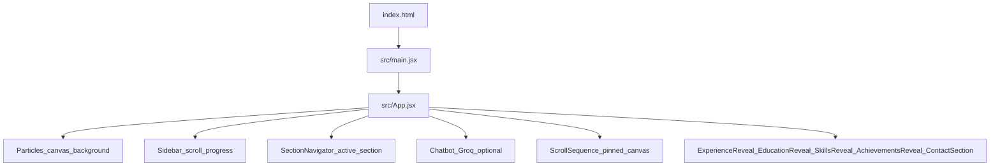
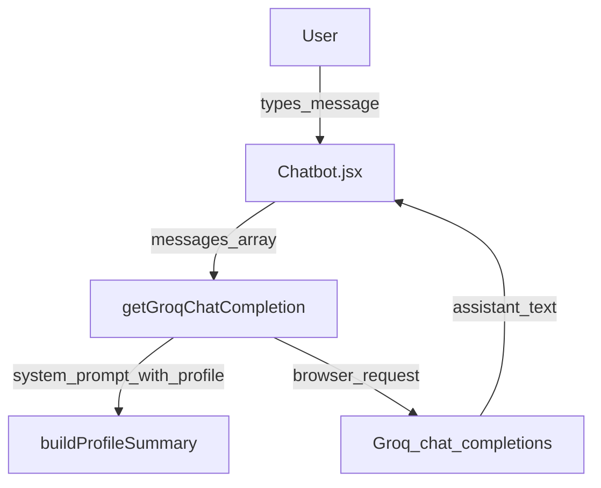

## Architecture overview

This is a single-page React app (Vite) that composes several scroll-reactive “systems”:

- Canvas-backed visuals (image sequences + particles)
- Scroll progress UI (sidebar dot, section navigator)
- Optional chat assistant (Groq SDK, client-side)

### Boot flow

- `index.html` mounts a `#root` and loads `src/main.jsx`
- `src/main.jsx` renders `<App />`
- `src/App.jsx` composes all layers and content sections

## Major modules

### ScrollSequence (`src/components/ScrollSequence/ScrollSequence.jsx`)
Pinned, scroll-scrubbed `<canvas>` image sequence driven by GSAP `ScrollTrigger`.

- **Frames**: loaded from `public/frames` via `${folder}/${name}.${ext}`
- **Naming**: 4-digit padded, 1-indexed (`0001.png` …)
- **Perf**: preloads frames in idle time (`requestIdleCallback` when available), draws only when the frame index changes.

### Particles (`src/components/Particles/Particles.jsx`)
Full-viewport canvas starfield.

- Uses requestAnimationFrame loop
- Tracks scroll delta to add a “scroll velocity” impulse to particle motion
- Wraps particles at edges (infinite field illusion)

### SectionNavigator (`src/components/SectionNavigator/SectionNavigator.jsx`)
Right-side vertical navigation that highlights the “active” section.

- Each section has an `id` (DOM anchor) and may have a `trackSelector` for a more precise “activation element”
- Uses a viewport threshold ratio (default ~0.42h) + optional `activationOffset` for fine tuning
- Click scroll uses a temporary lock to prevent active-state flicker during smooth scroll

### Sidebar (`src/components/Sidebar/Sidebar.jsx`)
Left-side scroll progress track.

- Computes overall scroll progress from `window.scrollY / (documentHeight - viewportHeight)`
- Positions a dot using CSS `top: calc(progress * 100vh - progress * 48px)`
- Supports mouse drag to scrub scroll position

### Reveal sections

These sections use scroll position to set inline styles (opacity/transform/box-shadow) for a “reveal while traveling upward” effect:

- `ExperienceReveal` (expects `public/experience-cards/0001.png`, `0002.png`)
- `EducationReveal` (expects `public/education-cards/0001.png`…`0003.png`)
- `SkillsReveal` (self-contained data; also exposes `.skills-reveal__line` used as an anchor by `AchievementsReveal`)
- `AchievementsReveal` (uses `src/data/profileData.js` for text; attempts to anchor itself relative to the skills line)
- `ContactSection` (static links: mailto/tel)

## Chat assistant (Groq)

- UI: `src/components/Chatbot/Chatbot.jsx`
- API wrapper: `src/lib/groqClient.js`
- Profile context: `src/data/profileData.js` → `buildProfileSummary()`

### Data flow

### Security note
`groqClient.js` uses `dangerouslyAllowBrowser: true` and reads `VITE_GROQ_API_KEY`. This is fine for a portfolio demo, but it is **not** safe for a public production deployment because the key can be extracted.

If you want production safety, move the call to a server/proxy and issue short-lived tokens or rate-limit requests.

## Asset checklist

- `public/frames/0001.png` … up to the `frameCount` configured in `src/App.jsx`
- `public/project-cards/0001.png` … (used by `ProjectCardFlight`)
- `public/experience-cards/0001.png`, `0002.png`
- `public/education-cards/0001.png` … `0003.png`
