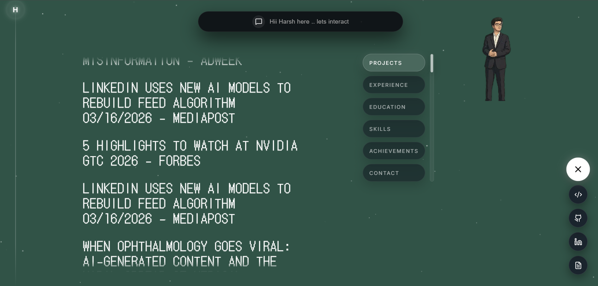
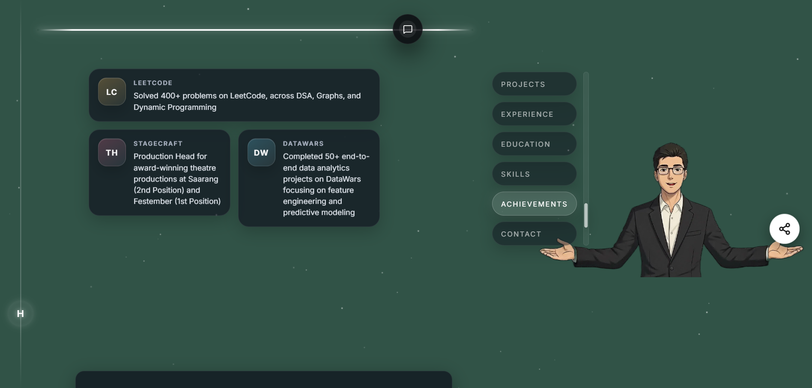

# Portfolio Site (React + Vite)

Interactive one-page portfolio built with React + Vite, featuring scroll-driven canvas animations (GSAP/ScrollTrigger) and an optional Groq-powered chat assistant.

## Live site
- [https://harsh16kumar.vercel.app/](https://harsh16kumar.vercel.app/)

## Website screenshots
Add your website screenshots in `public/screenshots/`.





## Tech stack
- **Runtime**: React
- **Build**: Vite
- **Animation**: `gsap` + `ScrollTrigger`
- **Icons**: `lucide-react`
- **Chat**: `groq-sdk` (client-side, demo use)

## Quick start
```bash
npm install
npm run dev
```

Build + preview:
```bash
npm run build
npm run preview
```

Lint:
```bash
npm run lint
```

## Content + customization
- **Main layout / sections**: `src/App.jsx`
- **Portfolio data for the chatbot**: `src/data/profileData.js`
- **Global styles**: `src/index.css` and `src/App.css`

## Assets (important)
This site expects certain image sequences under `public/`:

- **ScrollSequence frames**: `public/frames/`
  - Naming: `0001.png`, `0002.png`, ... (4-digit zero padded)
  - Controlled by `src/App.jsx` via `<ScrollSequence frameCount={...} folder="/frames" ext="png" />`
- **Card stacks / images**:
  - `public/experience-cards/0001.png`, `0002.png`
  - `public/education-cards/0001.png` ... `0003.png`
  - `public/project-cards/0001.png` ... (used by `ProjectCardFlight`)

If any of these folders/files are missing, the UI will still render but those images/animations will appear blank.

## Groq chatbot (optional)
The chat assistant calls Groq from the browser (see `src/lib/groqClient.js`). For local dev you can set:

- `VITE_GROQ_API_KEY` in `.env` (root)

Security note:
- **Do not commit keys**. This repo already ignores `.env` via `.gitignore`.
- If you want this “production safe”, move the Groq call behind a small server/proxy so the key is never shipped to the client.

## Deeper docs
- Architecture notes: `ARCHITECTURE.md`
